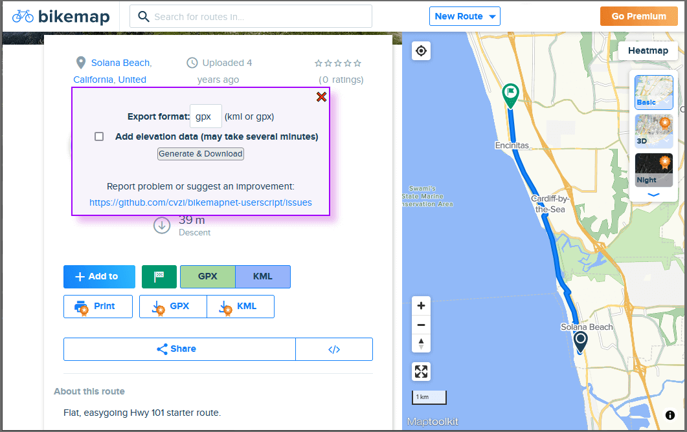

# Bikemap.net Export GPX and KML routes

Download GPX and KML files for a route on bikemap.net

**This is a first version with a very limited range of functions**

This program is a userscript for your browser. It's primarily designed for Firefox and Chrome with
[Tampermonkey](https://www.tampermonkey.net/) or similar userscript addons.
General information about userscripts and how to use them can be found at [openuserjs.org/about/Userscript-Beginners-HOWTO](https://openuserjs.org/about/Userscript-Beginners-HOWTO).

If you already have a userscript extension installed, you can **[click to install](https://greasyfork.org/scripts/445713-bikemap-net-export-gpx-and-kml-routes/code/Bikemapnet%20Export%20GPX%20and%20KML%20routes.user.js)** this script.


Screenshot:


## Development

Clone the repository and install dependencies with npm
```sh
git clone git@github.com:cvzi/bikemapnet-userscript.git
cd bikemapnet-userscript
npm install
```

### Bundle

Bundle everything from `src/` into `dist/bundle.user.js`:

`npm run build`

or

`npx rollup --config`


### Development server
`npm run serve`

or

`node -r esm server.js`

This will automatically update `dist/bundle.user.js` when code changes and serve it on [localhost:8124](http://localhost:8124/).

It also creates a second userscript `dist/dev.user.js`, if you install it in Tampermonkey, it will automatically fetch the latest version from http://localhost:8124/bundle.user.js once you reload a website with F5.


### Bundle without source map

Bundle for publishing without sourcemapping to `dist/release-3.2.1.user.js`

`npm run build:release`

or on Windows

`npm run build:release:win32`

